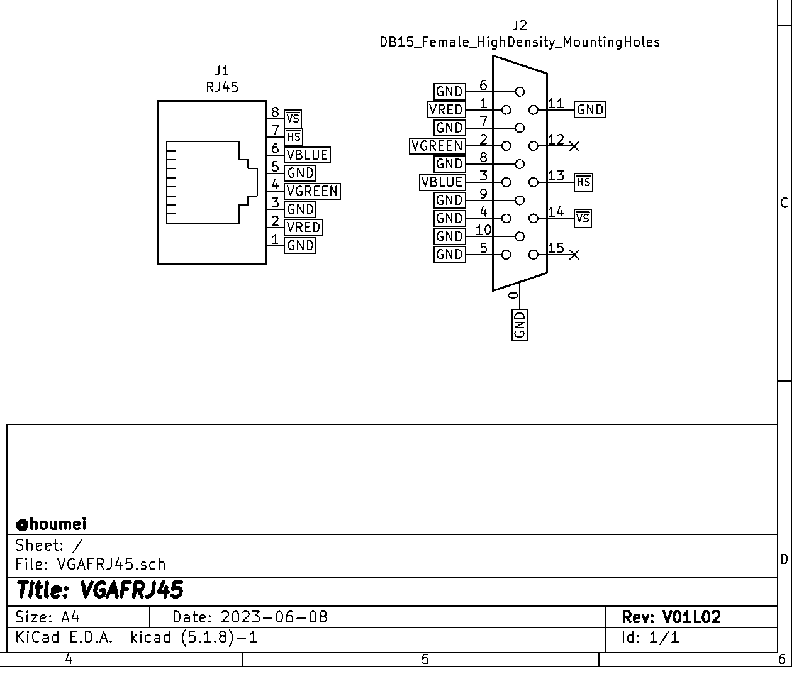
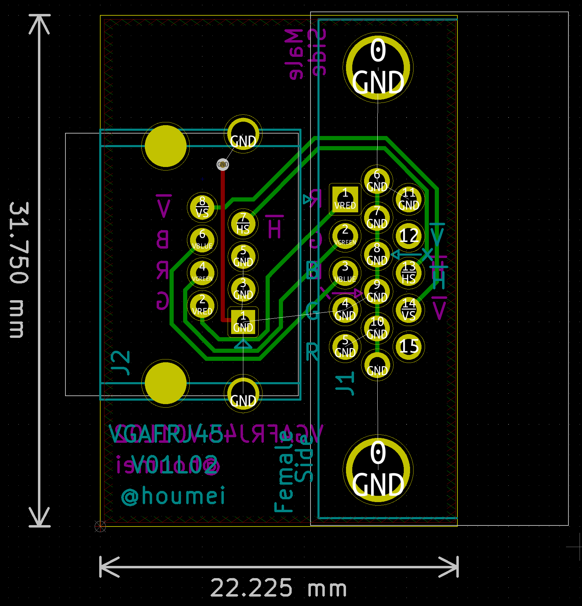

# VGAFRJ45 VGA Female to RJ45 video converter (KiCad5)  

Schematic

PCB

部品表 
J1-J3 [３．５ｍｍ４極ミニジャック　基板取付用　ＭＪ－４ＰＰ－９](https://akizukidenshi.com/catalog/g/gC-06070/)  
J4 [ピンヘッダ　１×４　（４Ｐ）　（１０個入）](https://akizukidenshi.com/catalog/g/gC-03950/) など ※オプション  

## 説明

## 履歴
V01L01 初版  

## VGAFRJ45V01L02GB - Gerber
JLCPCBなどにそのまま出図可能です。  
